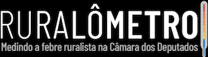

----
(Read project [summary](http://datadrivenjournalism.net/featured_projects/ruralometro_evaluating_how_brazils_congressmen_impact_socio_environment) in English)

O [Ruralômetro](https://ruralometro.reporterbrasil.org.br/) é um banco de dados e uma ferramenta interativa que mede como os deputados federais eleitos em 2014 agiram frente a projetos de lei e medidas provisórias que têm impactos sobre o meio ambiente, os povos indígenas e trabalhadores rurais.

Desenvolvido pela [Repórter Brasil](http://reporterbrasil.org.br/) com uma equipe multidisciplinar, a ferramenta parte de duas bases de dados para avaliar e pontuar a atuação dos parlamentares nessas áreas: seus votos nesta legislatura e os projetos de lei propostos por cada um.

Para fazer uma avaliação de mérito de cada projeto, foram chamadas organizações do setor socioambiental. Elas classificaram os projetos votados e propostos de acordo com seu impacto (positivo ou negativo) para o meio ambiente, povos indígenas e trabalhadores rurais. São elas: Instituto Socioambiental (ISA), Comissão Pastoral da Terra (CPT), Confederação Nacional dos Trabalhadores na Agricultura (Contag), Confederação Nacional dos Trabalhadores Assalariados(as) Rurais (Contar), Conselho Indigenista Missionário (Cimi), Federação de Órgãos para Assistência Social e Educacional (Fase), Greenpeace e Fundação Abrinq pelos Direitos da Criança e do Adolescente.

Assim, cada deputado ganhou uma pontuação individual, que leva em conta todos os projetos que ele votou o propôs. Essa pontuação foi aplicada à escala de temperatura corporal humana: quanto mais projetos com impacto negativo o deputado votou ou propôs, mais alta é sua temperatura. Podendo chegar a níveis de febre.

O Github do Ruralômetro apresenta os programas que foram utilizados para extrair e analisar os dados. Os programas são em Python 3.6 (foi utilizado Jupyter Notebook) e R 3.4.0. O trabalho foi dividido em pastas com cada etapa.

----

### BENS
É o programa que acessa as declarações de bens dos deputados federais eleitos em 2014 e depois filtra apenas os bens rurais. O grau de transparência da declaração de bens em 2018 caiu e não é mais possível por exemplo saber os tipos de cada bem

### CANDIDATOS
É o programa que mostra quais dos membros da Frente Parlamentar da Agropecuária (bancada ruralista) são deputados federais eleitos em 2014. Essa informação será usada em outros pontos do projeto. Cria também o dataframe base que terá informações gerais dos 513 deputados eleitos em 2014 - total de doações, partidos políticos atuais, se disputa reeleição e para qual cargo

### EMPRESAS
A partir de informações da Receita Federal mostra quais são as empresas rurais dos deputados federais eleitos em 2014

### FOTOS
Acessa o site da Câmara dos Deputados e baixa as fotos dos 513 deputados federais eleitos em 2014

### INSS/FUNRURAL
Com base em informações da Procuradoria-Geral da Fazenda Nacional, essa base mostra quais deputados têm empresas com dívidas ao INSS e quais dessas empresas devem ao Funrural (Previdência rural)

### PROCESSOS
Verifica no site do Supremo Tribunal Federal quais os processos que os deputados federais eleitos em 2014 respondem

### PROJETOS
Verifica a lista autoria de projetos legislativos indicados por organizações do setor socioambiental e seleciona apenas os dos deputados eleitos em 2014

### VOTOS
Baixa a lista de votações legislativas selecionadas e seleciona apenas os votos de deputados federais eleitos em 2014

### TEMPERATURA
Programa estatístico que analisa os projetos e votações para gerar notas dos deputados federais. Para fins didáticos as notas têm nomenclatura de temperatura

### IBAMA
Verifica quais deputados federais eleitos em 2014 receberam doações de empresas ou pessoas físicas que têm áreas embargadas pelo Ibama por irregularidades ambientais. Também mostra quais deputados estão diretamente nesta lista

### TRABALHO ESCRAVO
Mostra quais foram os deputados eleitos em 2014 que receberam doações de empresas ou pessoas físicas autuados por terem sido flagradas com trabalhadores em condições análogas à escravidão

### RURALÔMETRO
São os dois programas finais para extrair as estatísticas dos deputados em relação a temperatura e número de aparição em cada item acima. O outro programa detalha as autorias de projetos e as votações - isso permite verificar o cálculo da temperatura e entender melhor os gráficos

----

#### Quer ajudar os desenvolvedores (que são jornalistas)?
Este é um projeto open source aberto e de mente aberta. Os principais objetivos são gerar dados públicos sobre a forma como políticos brasileiros tratam questões socioambientais. Se você tiver comentários, críticas ou sugestões, basta escrever-nos (contato@reporterbrasil.org.br) ou escrever no Issues/Pull requests.

Atualizado em 11/set/2018
